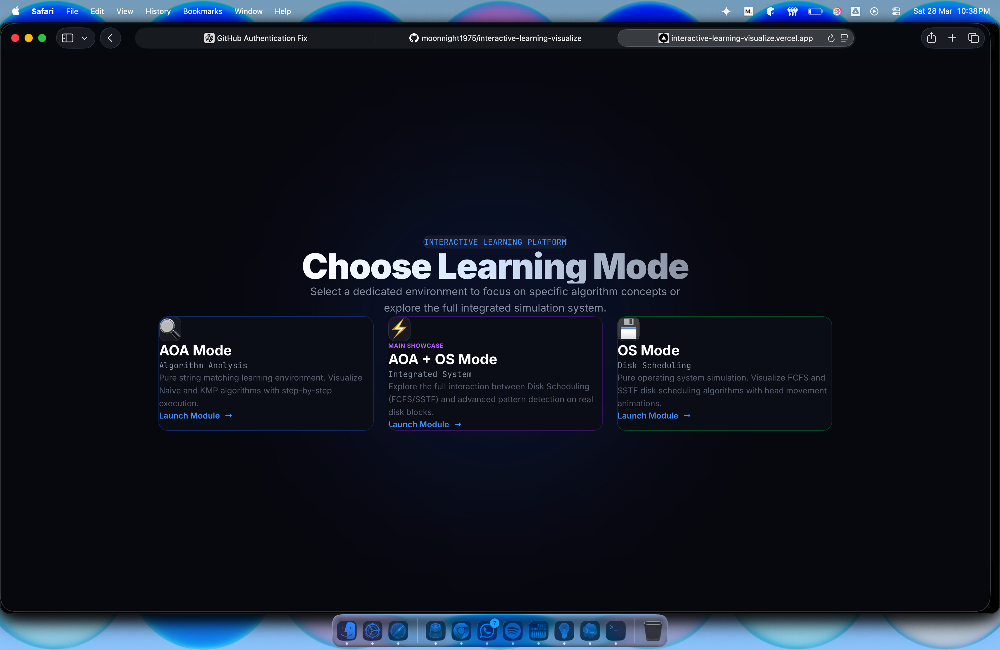
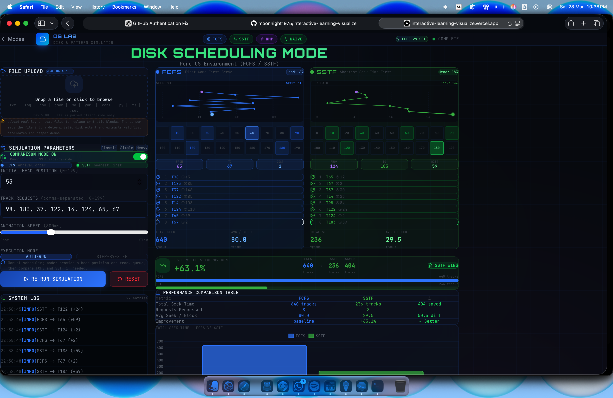

# OS + AOA Interactive Learning Platform

An interactive teaching project that combines Operating Systems concepts with Analysis of Algorithms in one visual web app.

The repository centers on a Next.js application in `os-lab/` that lets students explore:

- Disk scheduling with `FCFS` and `SSTF`
- String matching with `Naive` and `KMP`
- Real file-backed simulations using uploaded text and log files
- Step-by-step playback, algorithm comparison, charts, and terminal-style logs

## Screenshots

### Landing Page



### OS Mode Comparison View



## Modes

### Combined Mode

Route: `/combined`

The main showcase mode that joins disk scheduling and pattern matching together.

- Runs disk head movement and content analysis in the same simulation
- Supports single-run mode and `FCFS vs SSTF` comparison mode
- Works with synthetic data or uploaded files mapped into simulated disk blocks
- Displays seek distance, comparisons, matches, hit counts, and live logs

### OS Mode

Route: `/os`

Focused only on disk scheduling.

- Simulates `FCFS` and `SSTF`
- Visualizes queue order, seek path, and total seek time
- Supports manual track input and file-backed tracks

### AOA Mode

Route: `/aoa`

Focused only on string matching.

- Runs `Naive`, `KMP`, or side-by-side comparison
- Highlights matches inside the input text
- Displays comparisons, matches, execution time, and the KMP `LPS` table

## Key Features

- Interactive visualizations for disk movement and request processing
- Deterministic file-to-disk block mapping for repeatable demos
- Multi-pattern watchlists with case-sensitive and whole-word search options
- Log signal extraction for keywords like `error`, `warning`, `timeout`, and `denied`
- Performance dashboards and charts for comparison-based learning
- Mobile-friendly responsive UI

## Tech Stack

- Next.js 16
- React 19
- TypeScript
- Tailwind CSS 4
- Framer Motion
- GSAP
- Chart.js with `react-chartjs-2`
- Lucide React

## Repository Structure

```text
os+aoa/
├── attack_log.txt        # Sample file for demos
├── os-lab/               # Next.js application
│   ├── src/app/          # App Router pages
│   ├── src/components/   # Visual and control components
│   ├── src/lib/          # Simulation and file parsing logic
│   └── package.json
└── test/                 # Helper/test scripts
```

## Getting Started

### Prerequisites

- Node.js 20+ recommended
- npm

### Install and Run

```bash
cd os-lab
npm install
npm run dev
```

Open [http://localhost:3000](http://localhost:3000).

## Production Build

```bash
cd os-lab
npm run build
npm start
```

## Available Scripts

Inside `os-lab/`:

- `npm run dev` - start the development server
- `npm run build` - create a production build with Webpack
- `npm start` - start the production server
- `npm run lint` - run the lint script

## How File-Backed Simulation Works

When a user uploads a file:

1. The file is read on the client side.
2. The content is split into blocks.
3. Each block is assigned a deterministic simulated track number.
4. Keywords and log signals are extracted.
5. The simulator uses those real blocks instead of generated synthetic content.

This makes the project useful for demos involving logs, traces, or real text files instead of only hardcoded examples.

## Sample Input

The repo includes `attack_log.txt`, which can be uploaded in the app to test file-backed analysis and watchlist detection.

## Notes

- Main routes are `/`, `/combined`, `/os`, and `/aoa`
- The UI is designed for both desktop and mobile screens
- File parsing and block analysis live in `os-lab/src/lib/fileParser.ts`
